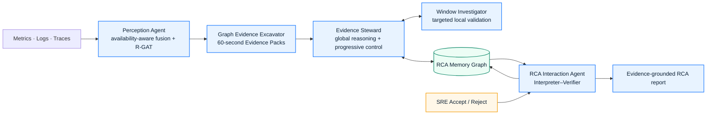
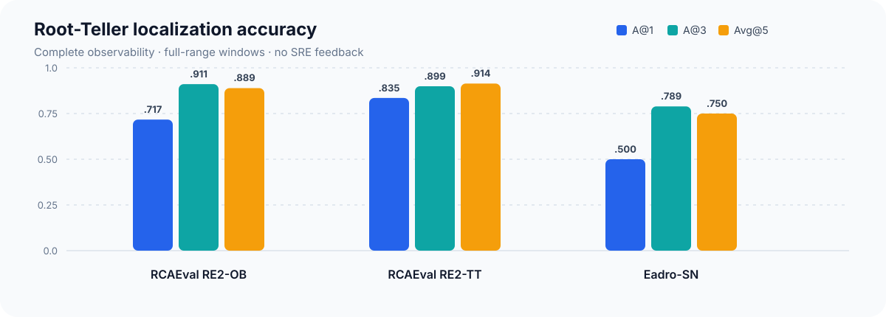
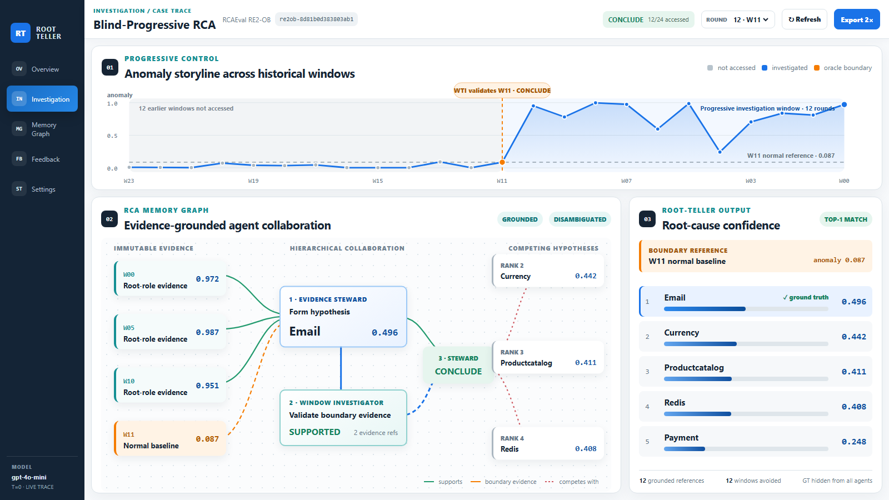
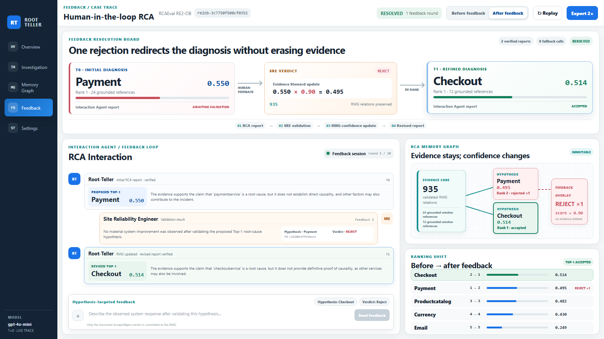

<div align="center">

# Root-Teller

### Progressive root-cause analysis via agentic collaboration

[](https://www.python.org/)
[](https://pytorch.org/)
[](docs/PAPER_CODE_ALIGNMENT.md)
[](system/README.md)

**Availability-aware perception · progressive investigation · evidence-grounded reporting · structured SRE feedback**

</div>

Root-Teller is an end-to-end RCA framework for microservice systems. It fuses
metrics, logs, and traces under incomplete observation, constructs
provenance-linked graph evidence, and coordinates a stateful **Evidence
Steward** with stateless **Window Investigators**. Diagnosis state is preserved
in an **RCA Memory Graph (RMG)** so that historical windows and operator
feedback refine hypotheses without deleting structural evidence.

## Architecture



## Paper result snapshot

The table below reproduces the Root-Teller rows reported in the manuscript.
The complete seven-method table is available in
[`evaluation/rq1/results/paper_table.csv`](evaluation/rq1/results/paper_table.csv).
The public evaluation package documents the grouped outer-fold protocol,
frozen split manifests, common evaluator, and method adapters used to produce
the paper-facing rankings. The CSV is a compact transcription of the reported
table and is not used by training or inference code.



| System | A@1 | A@3 | Avg@5 |
|---|---:|---:|---:|
| RCAEval RE2-OB | 0.717 | **0.911** | 0.889 |
| RCAEval RE2-TT | **0.835** | **0.899** | **0.914** |
| Eadro-SN | **0.500** | **0.789** | **0.750** |

Across the three systems, Root-Teller obtains macro-averages of 0.684 A@1,
0.866 A@3, and 0.851 Avg@5. See the
[`paper-to-code alignment`](docs/PAPER_CODE_ALIGNMENT.md) for the precise
experimental boundary and claim mapping.

## Local interactive system

The bundled local interface accepts an absolute case path or a ZIP archive,
runs the same core implementation, and exposes progressive window access, RMG
state, ranked hypotheses, verified reports, and structured feedback.

<table>
<tr>
<td width="50%"></td>
<td width="50%"></td>
</tr>
<tr>
<td align="center"><b>Blind-progressive investigation</b></td>
<td align="center"><b>Feedback-driven refinement</b></td>
</tr>
</table>

### Quick start on Windows

```powershell
py -3.12 -m venv .venv
.\.venv\Scripts\python -m pip install --upgrade pip
.\.venv\Scripts\python -m pip install -e ".[logs,test]"
.\.venv\Scripts\python -m pip install -r system\requirements.txt

$env:ROOTTELLER_WORKSPACE = "D:\path\to\your\workspace"
$env:ROOTTELLER_API_KEY = "your-openai-compatible-key"
$env:ROOTTELLER_API_BASE = "https://your-endpoint.example/v1"

.\system\start.ps1 -Workspace $env:ROOTTELLER_WORKSPACE -Port 4315
```

Open <http://127.0.0.1:4315/>. The API variables are optional: without them,
the interface runs the deterministic evidence path and clearly labels the
fallback. Credentials are never sent to the browser or written to exported RCA
artifacts. See [`system/README.md`](system/README.md) for supported case layouts
and validation details.

## Evaluation reproduction

Place the public datasets under the workspace layout documented in
[`evaluation/rq1/README.md`](evaluation/rq1/README.md), set the API variables,
and run each dataset/seed pair in an isolated directory. The commands below
reconstruct the paper protocol from the released code; benchmark telemetry and
experiment-host API responses are not redistributed by this repository.

```powershell
python -m root_teller.multidataset.rq1_three_seed --stage all --dataset re2_ob --seed 41
python -m root_teller.multidataset.rq1_three_seed --stage all --dataset re2_tt --seed 41
python -m root_teller.multidataset.rq1_three_seed --stage all --dataset eadro_sn --seed 41

# Repeat with seeds 42 and 43, then aggregate and verify.
python -m root_teller.multidataset.rq1_three_seed --stage aggregate
python -m root_teller.multidataset.verify_rq1_three_seed
```

Generated checkpoints, LLM responses, per-case predictions, and raw data remain
under the local workspace and are ignored by Git. Reproduction therefore
requires local copies of the cited public benchmarks and access to the selected
LLM backend.

The exact nested split manifests, compact paper table, and portable baseline
adapters are documented in
[`evaluation/rq1/README.md`](evaluation/rq1/README.md).

## Telemetry-unavailability views

The repository does not redistribute the 18 materialized GMO/IAMI dataset
views. Generate them locally with:

```powershell
python tools\telemetry_unavailability\prepare.py --help
```

The generator implements GMO-Metric/Log/Trace and IAMI-Metric/Log/Trace for
RCAEval RE2-OB, RCAEval RE2-TT, and Eadro-SN. See
[`tools/telemetry_unavailability/README.md`](tools/telemetry_unavailability/README.md).

## Repository map

```text
src/root_teller/module1/        Perception Agent, multimodal encoders, R-GAT
src/root_teller/module2/        Evidence Packs, agents, RMG, progressive control
src/root_teller/module3/        Verified reporting and feedback refinement
src/root_teller/multidataset/   RQ1 grouped-fold and three-seed reproduction
system/                         Local FastAPI application and web interface
evaluation/rq1/                 RQ1 protocol and compact paper result table
evaluation/rq2/                 GMO/IAMI generator-to-consumer path contract
tools/telemetry_unavailability/ GMO/IAMI view generator and semantic validator
baselines/                      Six upstream baseline implementations
configs/                        Paper-aligned frozen public configurations
tests/                          Unit, integration, and paper-alignment contracts
```

The public repository also retains `office_mini_storm_dataset/` as separately
maintained research material. It is not used by the Root-Teller paper
experiments and is outside the Root-Teller release-audit and checksum scope.

The release focuses on the executable Root-Teller implementation and the
paper-facing material needed to inspect the evaluation boundary. Large
experiment-host workspaces, API response caches, raw benchmark data, and
private per-case evaluator files are intentionally excluded. See
[`docs/PAPER_CODE_ALIGNMENT.md`](docs/PAPER_CODE_ALIGNMENT.md) for the precise
public-release scope.

## Baselines and data

Baseline provenance, upstream artifacts, and redistribution boundaries are
listed in [`baselines/README.md`](baselines/README.md). Any included third-party
files remain subject to their upstream license and dependency terms. RCAEval
and Eadro-SN are not redistributed and remain subject to their original
project licenses and access conditions.
